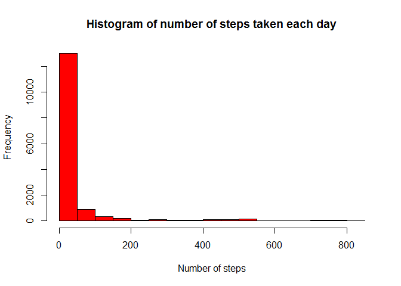
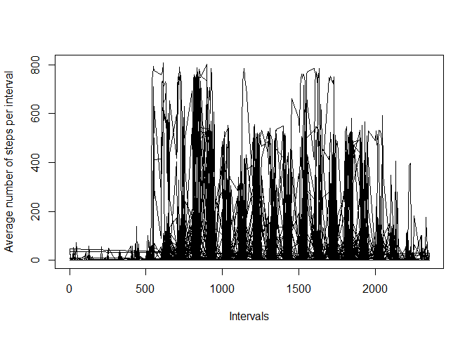
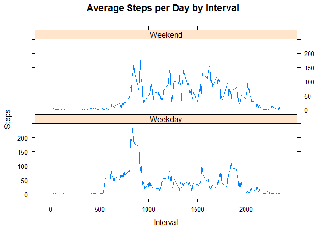

Assignement - Using Knitr Package
---------------------------------

This assignment uses data collected from a personal activity monitoring
device. This device collects data at 5 minute intervals throughout the
day. The data consists of 2 months (October and November, 2012) of data
from an anonymous individual.

Dataset: [Activity monitoring
Data](https://d396qusza40orc.cloudfront.net/repdata%2Fdata%2Factivity.zip)

Variables included in the dataset:  
1. Steps  
2. Date  
3. Interval

Solution
--------

### 1. Loading the data.

    data <- read.csv("activity.csv",header = TRUE)

### 2. Preprocessing data

    clean_data <- subset(data, !is.na(data$steps))
    clean_data$date <- as.Date(clean_data$date)

Mean and median of total number of steps taken per day
------------------------------------------------------

### 1.Total number of Steps taken PER Day

    total_steps <- sum(data$steps)
    total_steps_per_day <- aggregate(data$steps ~ data$date, data, sum)

### 2. Histogram of the total number of steps taken each day

    hist(clean_data$steps, col="red", main="Histogram of number of steps taken each day", xlab = "Number of steps", ylab = "Frequency")

<!-- -->

### 3. mean and median of the total number of steps taken per day

        mean_per_day <- aggregate(data$steps ~ data$date, data, mean)
        median_per_day <- aggregate(data$steps ~ data$date, data, median)

Average daily-activity pattery
------------------------------

### 1. Making a time-series Plot

    plot(clean_data$interval,clean_data$steps, type = "l", xlab = "Intervals", ylab = "Average number of steps per interval")

<!-- -->

### 2. which 5 minute interval contains the maximum number of steps

    steps_by_interval <- aggregate(steps ~ interval, data, mean)
    max_interval <- steps_by_interval[which.max(steps_by_interval$steps),1]

Interval with maximum number of steps: 835

### 1. total number of missing values in the dataset

        missing_data <- subset(data, is.na(data$steps))
        rows <- nrow(missing_data)

Total Number of Missing Values: 2304

### 2. handling NA data with mean of the intervals. this is the complete data.

    missing_data_update <- transform(data, missing_data$steps, steps_by_interval$steps[match(data$interval, steps_by_interval$interval)], data$steps)
    new_rows <- nrow(missing_data_update)

Total number of records in new data: 17568

### 3. New data and histogram with new data

        steps_by_day <- aggregate(steps ~ date, missing_data_update, sum)
        hist(steps_by_day$steps, main = paste("Total Steps Each Day"), col="blue", xlab="Number of Steps")

<!-- -->

### 4. calculating the new mean from the updated data. there are more steps in the updated data.

        new_mean <- mean(steps_by_day$steps)
        new_median <- median(steps_by_day$steps)

There are more steps in the updated data when compared to the initial
cleaned data.  
Mean: 1.076618910^{4}  
Median: 10765

### 1. activity pattern in weekday n weekend pattern.

        weekdays <- c("Monday", "Tuesday", "Wednesday", "Thursday", "Friday")
        missing_data_update$dow = as.factor(ifelse(is.element(weekdays(as.Date(missing_data_update$date)),weekdays), "Weekday", "Weekend"))
        avg_steps_per_interval <- aggregate(steps ~ interval + dow, missing_data_update, mean)

### 2. Plotting a time-series of 5-minute interval

        library(lattice)
        xyplot(avg_steps_per_interval$steps ~ avg_steps_per_interval$interval|avg_steps_per_interval$dow, main="Average Steps per Day by Interval",xlab="Interval", ylab="Steps",layout=c(1,2), type="l")

<!-- -->
